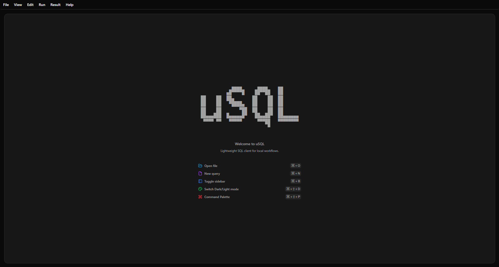
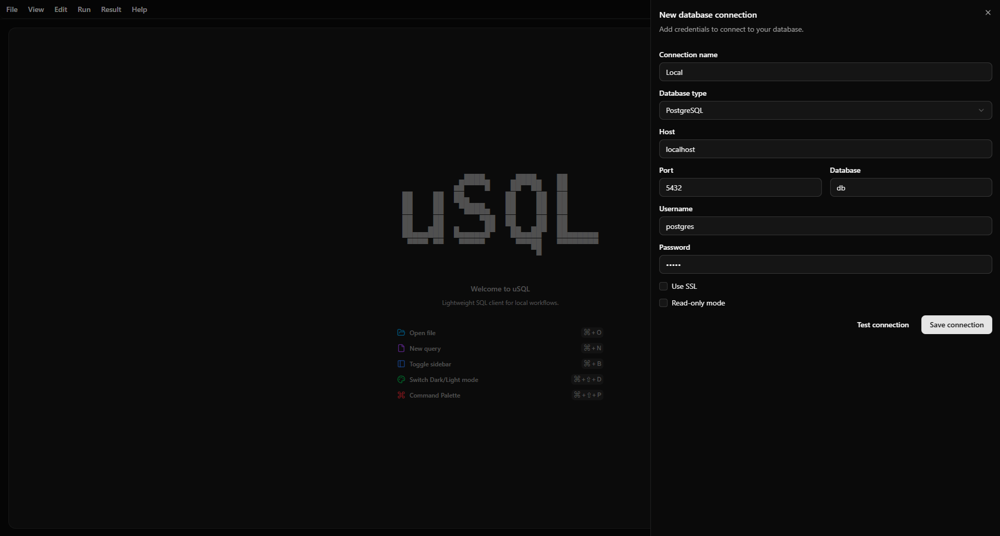
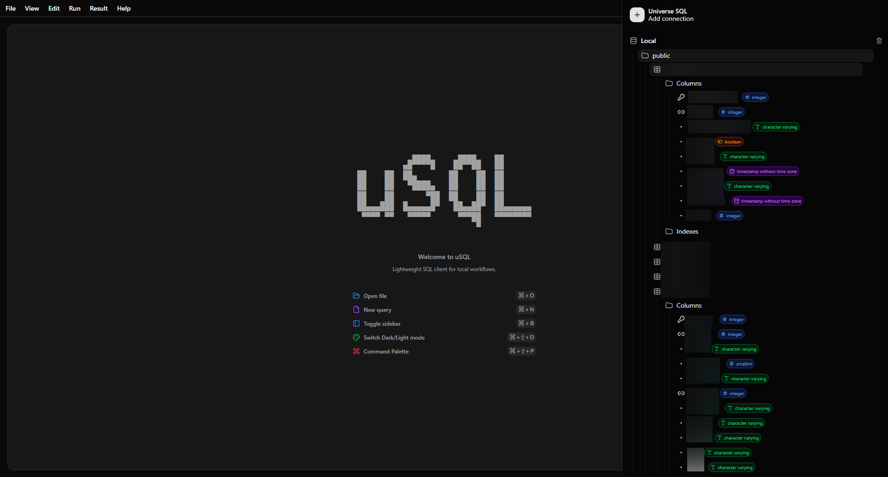
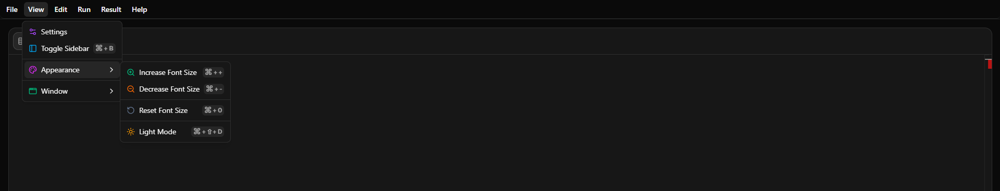
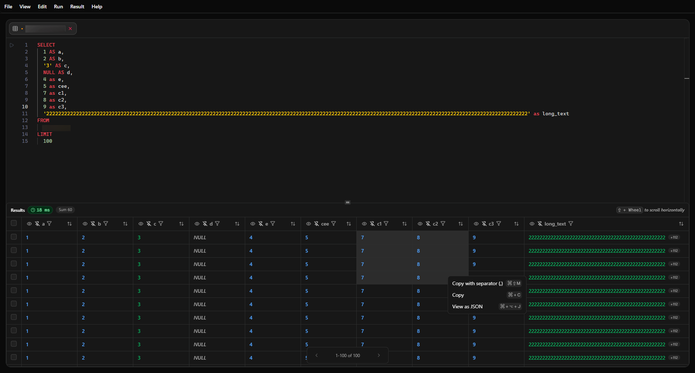

# Universe SQL (usql)

**Universe SQL** (or **usql** for short) is a user-friendly desktop application designed to make working with PostgreSQL databases simple, fast, and highly visual.

Whether you are navigating complex data structures or writing your first SQL query, **usql** provides a clean, modern interface that removes the friction often associated with database management, bringing intelligent, **DataGrip-like features** to a lightweight tool.

## 📸 A Quick Look Inside

Get a glimpse of how **usql** simplifies your workflow:

*A clean, distraction-free welcome screen*

*Pain-free connection management*

*Intuitive visual explorer for tables, columns, and database schemas*

*Quick access menu and easy navigation*

*Intelligent query editor combined with rich data viewing*

## 🌟 What can you do with usql?

We've built **usql** with features aimed at saving you time and reducing complexity, inspired by professional IDEs but accessible to everyone:

### 🔌 Painless Connection Management
- No need to remember connection strings every time.
- Save, edit, and organize multiple PostgreSQL database connections.
- Connect with just a single click.

### 📝 Smart & Supportive Query Editor
- **DataGrip-like Auto-completion:** Get intelligent suggestions for tables, schemas, and columns as you type, so you don't have to memorize your database schema.
- **Syntax Highlighting:** SQL keywords and variables are color-coded, making your queries easier to read and spot errors.
- **Auto-formatting:** Keep your SQL code neat and organized automatically.
- **Run Sub-queries:** Just like professional IDEs, highlight a specific part of your code to run just that segment without executing the entire file.

### 🗂️ Visual Database Explorer
- Browse through your databases, tables, and views from an intuitive left-hand sidebar.
- No need to write `SELECT * FROM...` just to see what's inside a table.
- Easily inspect column names, data types, and structures at a glance.

### 🔍 Rich Data Viewing Experience
- **Tabular View:** Read your query results in clean, easy-to-navigate tables.
- **JSON Inspector:** Dealing with complex JSON data? We format and display JSON columns clearly so they are actually readable.
- **Table Insights:** Quickly view table comments directly within the app to understand the context of your data.

### 🎨 Designed for Comfort
- **Dark Mode & Light Mode:** Seamlessly switch themes to suit your preference and reduce eye strain.
- **Clean Interface:** We believe database tools don't have to look cluttered. Enjoy an interface designed for focus and simplicity.

## 🚀 Who is usql for?

- **Data Analysts & Managers:** If you need to regularly check data or run reports without wrestling with bloated enterprise tools.
- **Students & Beginners:** If you are learning SQL, the intelligent auto-completion and clear error highlighting will guide you.
- **Developers:** If you want a lightweight, fast-starting desktop app with **DataGrip-like** query capabilities for quick database interactions while coding.

---
*Universe SQL - Simplifying how you interact with PostgreSQL!*
